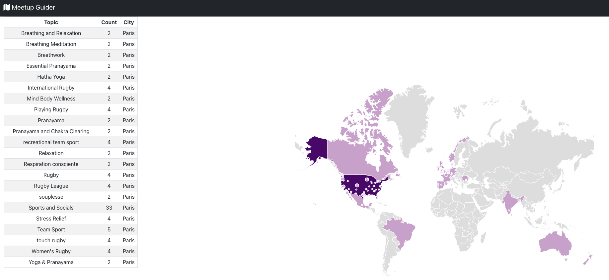

# Meetup Guider App

A simple application, that connects to connect to the meetup.com [RSVP stream](https://stream.meetup.com/2/rsvps), to retrieve, process and display the most popular meetup locations.  The backend is a .net core RESTful API and frontend is a react app.

## Start application

- install [Docker Compose](https://docs.docker.com/compose/install/);
- run `docker-compose up -d` in the root of the application folder, where `docker-compose.yml` is located; 
- backend api **documentation**: [http://localhost:8080](http://localhost:8080/);
- backend api basic **healthcheck** endpoint: [http://localhost:8080/health](http://localhost:8080/health);
- frontend ui: [http://localhost:80](http://localhost:80/); NB: it will normally take few mininuts to collect sufficient data from meetup.com;
- mssql database: [127.0.0.1,1433](127.0.0.1,1433). demo credentials are in the docker-compose.yml;
- rsvp loader: this stand-alone application will automatically connect to the [RSVP stream](https://stream.meetup.com/2/rsvps). If no data are collected, it is recommended restarting this container.

## App demo

## Application design

There are clear servaral ways to design this application. It is currently designed as below:

- `RSVP loader` is a small .netcore application that connects to the [RSVP stream](https://stream.meetup.com/2/rsvps) and saves the rsvps into a relational database (mysql in this case);
- `db`: a simple mysql express database that stores and processes the rsvp;
- `Meetup Guider Backend` is a .netcore RESTFul API application;
- `Meetup Guider Frontend` is a small react app that displays rsvps on an interactive geo heatmap.

## Project file structure

| Folder/File                                   | Description |
| -------------                                 |:-------------:|
| meetupguider-api                                 | contains all the source code for backend api and rsvp loader |
| meetupguider/src/RSVPLoader          | .net core console that connects to the RSVP Streem |
| warehouse-api/src/Warehouse.API               | .net core webapi application |
| meetupguider/src/Warehouse.Entities          | entity/database design |
| meetupguider/src/Warehouse.Services          | meetupguider services |
| meetupguider-api/tests/meetupguider.ServiceTests    | unit tests for meetupguider services |
| meetupguider-ui                                  | contains all the source code for frontend react app |
| docker-compose.yml                            | bring up the whole app as docker containers |
| dockerfiles                                   | dockerfiles, env and db init script |
| dockerfiles/loader.Dockerfile                    | rsvp loader docker file |
| dockerfiles/api.Dockerfile                    | api docker file |
| dockerfiles/ui.Dockerfile                    | react ui docker file |
| dockerfiles/demo.env                          | env for api server |
| dockerfiles/mssql.Dockerfile                  | mssql server dockerfile |
| dockerfiles/db                                | mssql init script |

#### furture improvements
- more tests for both backend and frontend!!!
- prepare the CI/CD pipeline (for example Github actions, Jenkins/Ansible etc).
- logs and performance monitoring.